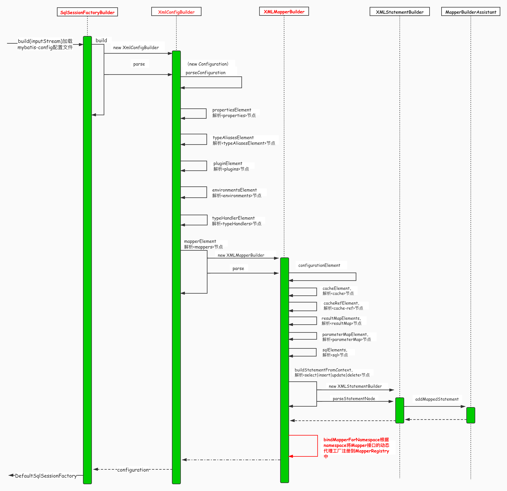

### Java基础

#### 什么是二叉排序树

二叉排序树即二叉查找树，满足若左子树不空，则**左子树上所有结点的值均小于它的根结点的值**；若右子树不空，则**右子树上所有结点的值均大于或等于它的根结点的值**；左、右子树也分别为二叉排序树；

#### 范型 类型擦除

#### 8 种基本类型的包装类和常量池

Byte,Short,Integer,Long,Character,Boolean；前面 4 种包装类默认创建了数值**[-128，127] 的相应类型的缓存数据**，Character 创建了数值在[0,127]范围的缓存数据，Boolean 直接返回 True Or False。缓存存放在常量池中，而如果超出对应范围仍然会去创建新的对象。
**自动装箱**用的是ValueOf方法`Integer i = 3`，即`Integer i1=Integer.valueOf(3)`；3在[-128，127]之间，故使用常量池对象，即：

```java
Integer i1=40;
Integer i2=Integer.valueOf(40);
//i1等于i2；
```

而若`Integer i1=200`，则为对象，比较地址。

当执行算术运算时，会**自动拆箱**。

#### 重写equals()必须重写hashcode()

对于基本类型	==	比较的是数值；对于引用数据类型	==	比较的是地址
equals()	源码就是	==	；不能用于比较基本数据类型。
若两个对象相等，则hashcode一定相等；但两个对象的hashcode相等，他们不一定equals()。

> Sting中的equals方法是**重写**过的，Object的equals方法比较的是`对象的内存地址`，而String比较的是`对象的值`；创建String类对象时，虚拟机会在常量池中查找有没有 已经存在的与要创建的值相同的对象，如果有就把他赋给当前引用。

构造方法的作用：用于类对象的初始化

多态

POJO类属性使用包装类数据类型；RPC方法的返回值使用包装数据类型；局部变量使用基本数据类型

浮点数之间的等值判断采用BigDecimal	（精度丢失）

Arrays.asList()方法：1、返回的是Arrays的内部类而不是ArrayList；2、是一个泛型方法，传入的数组需为对象数组，若传入int[]（基本类型数组），则整个数组作为List的唯一元素。

equals()的空指针异常

不在foreach里进行list的add(),remove()操作，可用iterator或者list.removeIf()方法

网关


#### final

> final修饰的类不能被继承，final类中的所有成员方法都会被隐式的指定为final方法；
> final修饰的方法不能被重写；
> final修饰的变量是常量，如果是基本数据类型的变量，则其数值一旦在初始化之后便不能更改；如果是引用类型的变量，则在对其初始化之后便不能让其指向另一个对象。

在构造方法内，若读final属性晚于写final属性，那读的值可能不是定义的值；
final属性可以通过**反射来修改**

#### synchronized

一个线程在获取`monitor`锁后才可以进入synchronized代码块，一旦**进入代码块**，该线程对于共享变量的缓存就会失效，因此 synchronized 代码块中对于共享变量的读取需要从主内存中重新获取，也就能**获取到最新的值**。
**退出代码块**的时候的，会将该线程写缓冲区中的数据**刷到主内存**中，所以在 synchronized 代码块之前或 synchronized 代码块中对于共享变量的操作随着该线程退出 synchronized 块，会**立即对其他线程可见**（这句话的前提是其他读取共享变量的线程会从主内存读取最新值）
总结：线程 a 对于进入 synchronized 块之前或在 synchronized 中对于共享变量的操作，对于后续的持有同一个监视器锁的线程 b 可见。

> Tips:在进入 synchronized 的时候，并不会保证之前的写操作刷入到主内存中，synchronized 主要是保证退出的时候能将本地内存的数据刷入到主内存。
> **对 Class 对象加锁、对对象加锁，它们之间不构成同步**。synchronized 作用于静态方法时是对 **Class 对象**加锁，作用于实例方法时是对实例加锁。
> 一个类中的两个 synchronized static 方法之间是否构成同步？构成同步。

#### volatile

**内存可见性**和**禁止指令重排序**
读一个 volatile 变量之前，需要先使相应的本地缓存失效，这样就必须到主内存读取最新值，写一个 volatile 属性会立即刷入到主内存。
volatile 的禁止重排序并不局限于两个 volatile 的属性操作不能重排序，而且是 volatile 属性操作和它周围的普通属性的操作也不能重排序。

> volatile适用场景：某个属性被多个线程共享，其中有一个线程修改了此属性，其他线程可以立即得到修改后的值；
> volatile 属性的读写操作都是无锁的，它不能替代 synchronized，因为**它没有提供原子性和互斥性**；
> volatile **只能作用于属性**，我们用 volatile 修饰属性，这样 compilers 就不会对这个属性做指令重排序；
> volatile 可以使得 long 和 double 的赋值是原子的。

#### Java8新特性

#### this, super不能用在static方法中？

被 static 修饰的成员属于类，不属于单个这个类的某个对象，被类中所有对象共享。而 this 代表对本类对象的引用，指向本类对象；而 super 代表对父类对象的引用，指向父类对象；所以， **this和super是属于对象范畴的东西，而静态方法是属于类范畴的东西**。

#### static{}静态代码块与{}非静态代码块

执行顺序：静态代码块 > 非静态代码块 > 构造方法 > 静态方法中的内容 > 静态方法中代码块。

#### 引用

由强到弱分为`强引用`；`软引用`：SoftReference类实现；`弱引用`：WeakReference类实现；`虚引用`：PhantomReference类实现，共4种。

#### 接口和抽象类区别

相同：都不能被实例化 
不同：

- 接口只有定义，不能有**抽象**方法的实现，而抽象类可以有定义与实现，方法可在抽象类中实现；
- 一个类可以实现多个接口，但一个类只能继承一个抽象类；

#### 为什么Java中只有值传递

​	就swap函数来说，传入**基本类型**，交换的是形参（实参的拷贝），实参的值不会改变；传入**对象**，交换的同样是形参，但是可以改变对象内参数的状态（形参是是实参的拷贝，指向同一个对象，故可以操作对象内的参数）。

#### 什么是上下文切换？

​	一个 CPU 核心在任意时刻只能被一个线程使用，为了让这些线程都能得到有效执行，CPU 采取的策略是为每个线程分配**时间片并轮转**的形式。
​	当前任务在执行完 CPU 时间片切换到另一个任务之前会先保存自己的状态，以便下次再切换回这个任务时，可以再加载这个任务的状态。任务从**保存到再加载**的过程就是一次上下文切换。

#### Thread.start() 方法时会执行 run() 方法，为什么不直接调用 run() ？

​	调用 start() 方法，会启动一个线程并使线程进入就绪状态，将当前线程加入threadgroup，当分配到时间片后就可以开始运行了。而run()仅仅是在主线程执行的普通方法。

#### Thread.sleep()和wait()的异同

​	同：都进入阻塞；

​	异：sleep()属于Thread类，wait()属于Object类；wait()必须在同步代码块中调用，sleep()没有要求；sleep()没有释放锁，而 wait()释放了锁。

#### 两线程交叉打印

```java
public static void main(String[] args) {
    MyRun myRun = new MyRun();
    Thread a = new Thread(myRun);
    Thread b = new Thread(myRun);
    a.start();
    b.start();
}
public static class MyRun implements Runnable{
    private int number = 1;
    @Override
    public void run() {
        synchronized (this){
            while (number<=20){
                this.notify();
                System.out.println(Thread.currentThread().getName()+"-"+number);
                number++;
                try {
                    if (number>20)  Thread.sleep(10);
                    else this.wait();	//释放锁
                }catch (InterruptedException e){
                    e.printStackTrace();
                }
            }
        }
    }
}
```

```java
//用LockSupport实现
public static Thread a,b;
public static void main(String[] args) {
    a = new Thread(new Runnable() {
            @Override
            public void run() {
                for (int i = 0; i < 10; i++) {
                    LockSupport.park(this);
                    System.out.println(Thread.currentThread().getName()+"B");
                    LockSupport.unpark(b);
                }
            }
        });
        b = new Thread(new Runnable() {
            @Override
            public void run() {
                for (int i = 0; i < 10; i++) {
                    System.out.println(Thread.currentThread().getName()+"A");
                    LockSupport.unpark(a);
                    LockSupport.park(this);
                }
            }
        });
        a.start();
        b.start();
}
```

#### 三线程交替打印

```java

```

#### Thread

​	每个Java对象都关联了一个监视器，也关联了一个**线程等待集合**。

​	Object.wait()以及Object.notify()都需要**持有对象monitor锁**才能正常进行，否则会抛出 IllegalMonitorStateException 异常。

​	当线程被设置中断状态为true不会立即抛异常，而是等待重新**获取锁**之后才抛出异常。

​	wait、notify和interrupt，若notify和interrupt同时发生，可能产生两种情况：wait正常返回，中断状态为true；wait抛出异常返回，中断状态重置为false。

​	sleep()方法**不会释放任何监视器锁**，也**不具有**同步语义，即不会与主内存交互。

#### 线程中断

​	Java 中的中断和操作系统的中断不一样，线程中断代表**线程状态**，每个线程都关联了一个**中断状态**，是一个 true 或 false 的 boolean 值，初始值为 false。
​	我们说中断一个线程，其实就是设置了线程的 interrupted status 为 true，至于说被中断的线程怎么处理这个状态，那是那个线程自己的事。

​	如果线程处于以下三种情况，那么当线程被中断的时候，能自动感知到：
​	1、来自 Object 类的 wait()，来自 Thread 类的 join()、sleep(long)，这几个方法的相同之处是，方法上都有: throws InterruptedException。如果线程阻塞在这些方法上（我们知道，这些方法会让当前线程阻塞），这个时候如果其他线程对这个线程进行了中断，那么这个线程会从这些方法中立即返回，抛出 InterruptedException 异常，同时重置中断状态为 false。
​	2、实现了 InterruptibleChannel 接口的类中的一些 I/O 阻塞操作，如 DatagramChannel 中的 connect 方法和 receive 方法等。如果线程阻塞在这里，中断线程会导致这些方法抛出 ClosedByInterruptException 并重置中断状态。
​	3、Selector 中的 select 方法

​	**InterruptedException异常**
​	Object 中的 wait() 方法，ReentrantLock 中的 lockInterruptibly() 方法，Thread 中的 sleep() 方法等等，这些方法都带有 `throws InterruptedException`，我们通常称这些方法为阻塞方法（blocking method）
​	阻塞方法一个很明显的特征是，它们需要花费比较长的时间（不是绝对的，只是说明时间不可控），还有它们的方法结束返回往往依赖于外部条件，如 wait 方法依赖于其他线程的 notify，lock 方法依赖于其他线程的 unlock等等。

#### String 和 StringBuffer、StringBuilder 的区别

​	String 类中使用`final`关键字修饰字符数组来保存字符串`private final char value[]`，故不可变。
​	String 中的对象是不可变的，也就可以理解为常量，线程安全；StringBuffer 对方法加了同步锁或者对调用的方法加了同步锁，所以是线程安全的。StringBuilder 并没有对方法进行加同步锁，所以是非线程安全的。

#### Java BIO、NIO、AIO

**BIO**属于同步阻塞 IO 模型：来一个新的连接，就新开一个线程去处理，之后的操作全部由那个线程来完成。（一对一）

**NIO**同步非阻塞IO（一对多）：

​	**Buffer**：核心是ByteBuffer，想象成一个数组

```java
属性：三个index
position
//从写操作模式到读操作模式切换的时候（flip），position 都会归零
//写操作：初始值是 0，每往 Buffer 中写入一个值，position 就自动加 1，代表下一次的写入位置。
//读操作：每读一个值，position 就自动加 1
limit
//写操作模式下，limit 代表的是最大能写入的数据，这个时候 limit 等于 capacity
//读模式，此时的 limit 等于 Buffer 中实际的数据大小
capacity	//总容量
```

​	**Channel**
​	`FileChannel`：文件通道，用于文件的读和写
​	`DatagramChannel`：用于 UDP 连接的接收和发送
​	`SocketChannel`：把它理解为 TCP 连接通道，简单理解就是 TCP 客户端
//待补充
​	`ServerSocketChannel`：TCP 对应的服务端，用于监听某个端口进来的请求
//待补充
​	**Selector**
​		用于实现一个线程管理多个Channel

**AIO**异步非阻塞IO：`AsynchronousSocketChannel`，`AsynchronousServerSocketChannel`和 `AsynchronousFileChannel`三个类

### 23种设计模式

##### 类、接口和类图

​	类具有封装性、继承性和多态性。接口是一种特殊的类，它具有类的结构但不可以被实例化，只可以被子类实现，含有抽象操作不包含属性。

​	类与类之间的关系（耦合度从弱到强）：
​	<span style="color:red">依赖关系</span>：临时性的关联，某个类的方法通过局部变量、方法的参数或者对静态方法的调用来访问被依赖类中的某些方法；
<span style="color:red">	关联关系</span>：对象之间的一种引用关系；
<span style="color:red">	聚合关系</span>：整体与部分，has-a关系。部分可独立与整体存在；
<span style="color:red">	组合关系</span>：整体与部分，cxmtains-a关系。部分与整体共生；
<span style="color:red">	泛化关系</span>：继承关系，is-a关系；
<span style="color:red">	实现关系</span>：接口与实现类之间的关系。	

###### 单例模式

​		单例类只有一个实例对象；单例对象必须由单例类自行创建；单例类对外提供一个访问该单例的全局访问点。
​		优点：单例模式保证内存中只有一个实例，减小开销，避免对资源的多重占用。
​		普通类的构造函数是公有的，外部类通过`new 构造函数()`来生成多个实例；若将构造函数设为**私有**，该类本身须定义一个静态私有实例，向外提供一个静态的public函数用于创建和获取该实例。

​		单例模式的实现：

```java
//懒汉单例（用的少）
public class LazySingleton{
    private static volatile LazySingleton instance = null;	//volatile:线程之间的可见性
/*volatile:保证此变量对所有线程的可见性；禁止指令重排序优化*/
    private LazySingleton(){}	//private确保类不会在外部被实例化
    public static synchronized LazySingleton getInstance(){
        if (instance == null)
            instance = new LazySingleton();
        return instance;
    }
}	//volatile和synchronized保证线程安全。
```

> 实现可见性：volatile 、synchronized、final(引用逃逸)

```java
//饿汉单例
public class HungrySingleton{
    private static final HungrySingleton instance = new HungrySingleton();	//final
    private HungrySingleton(){}
    public static HungrySingleton getInstance(){
        return instance;
    }
}	//在类创建的同时就已经创建好一个静态对象供系统使用，以后不再改变，线程安全。
```

```java
//双检锁单例			实例域延迟初始化
public class Singleton {
    private volatile static Singleton instance;
    private Singleton(){}
    public Singleton getInstance(){
        if (instance == null){	//不存在则加锁	判空为了提高效率
            synchronized (Singleton.class){
                if (instance == null){	//不存在则new	判空为了防止创建多个对象（重排序将锁和该句交换）
                    instance = new Singleton();
                }
            }
        }
        return instance;
    }
}
```

> ​	双检锁为什么要用volatile：
> ​	有两个线程a、b，a在getInstance()执行到new Singleton()时，在给对象**属性赋值**以及对象**引用赋值**时可能发生**指令重排序**，导致线程b在getInstance()时认为instance不为null，直接返回未构造完成的instance。
> ​	利用volatile禁止指令重排序

```java
//静态内部类			静态域延迟初始化
public class Singleton {
    private Singleton(){}
    private static class Singleton SingletonHolder {
        private static final Singleton INSTANCE = new Singleton();
    }
    public static final Singleton getInstance(){
        return SingletonHolder.INSTANCE;
    }
}
```

###### 原型模式

​	clone比new性能上更优。

###### 工厂模式

​	·简单工厂模式(静态工厂模式)	简单工厂、抽象产品接口、具体产品
<span style="color:red">用方法返回不同实例对象来代替不同的构造函数，而不用new创建</span>	可避免构造函数冲突
​	·工厂方法模式	抽象工厂接口、抽象产品接口、具体工厂实现、具体产品实现	（一类产品）
​	·抽象工厂模式	抽象工厂接口**创建**抽象产品接口、具体工厂实现、具体产品实现	（多类产品）

###### 建造者模式


###### 代理模式

​	静态代理：

​	动态代理，包含两种：
​	jdk动态代理：实现InvocationHandler接口重写invoke()方法与Proxy.newProxyInstance()方法。一个接口，一个实现类，一个代理类。
​	CGlib动态代理：MethodIntercepter接口重写Intercept()方法，和Enhancer.create()创建代理类。一个被代理类，一个拦截器类实现了MethodIntercepter接口，一个代理类。
​	区别：**JDK 动态代理只能代理实现了接口的类，而 CGLIB 可以代理未实现任何接口的类。**

###### 观察者模式

​	推/拉模式：拉模式将被观察者**自身**传给观察者，观察者自取所需。
​	被观察者类Watched继承Observable类；Watcher实现Observer接口。Watched类watched.notify()通知Watcher类watcher.update(Observable o)更新。

###### 模板方法模式

​	定义一个操作中的算法骨架，而将算法的一些步骤延迟到子类中，使得子类可以不改变该算法结构的情况下重定义该算法的某些特定步骤。
​	模板方法：定义了算法的骨架，按某种顺序调用其包含的基本方法。
​	基本方法：是整个算法中的一个步骤，包含以下几种类型。
- 抽象方法：在抽象类中声明，由具体子类实现。
- 具体方法：在抽象类中已经实现，在具体子类中可以继承或重写它。
- 钩子方法：在抽象类中已经实现，包括用于判断的逻辑方法和需要子类重写的空方法两种。

AQS的设计就是基于模板方法模式。

### 计算机网络

#### 计算机网络7层模型

​	物理层，数据链路层，网络层，传输层，会话层，表示层，应用层

​	1.物理层：物理层主要做的事情就是 透明地传送比特流。**物理层考虑的是怎样才能在连接各种计算机的传输媒体上传输数据==比特流==**，物理层的作用正是尽可能地**屏蔽**掉这些传输媒体和通信手段的**差异**，使物理层上面的数据链路层感觉不到这些差异，这样就可以使数据链路层只考虑完成本层的协议和服务，而不必考虑网络的具体传输媒体和通信手段是什么。

​	2.数据链路层：
​	网桥：一种用于数据链路层实现中继，连接两个或多个局域网的网络互连设备
​	交换机：实质是一个多接口的网桥
​	MAC地址：物理地址、硬件地址，用来定义网络设备的位置。
​	数据链路层的点对点信道和广播信道的特点，以及这两种信道所使用的协议（PPP 协议以及 CSMA/CD 协议）的特点
​	局域网的优点是：具有广播功能，从一个站点可方便地访问全网；便于系统的扩展和逐渐演变；提高了系统的可靠性，可用性和生存性
​	数据链路层传输的协议数据单元是**帧**。数据链路层的三个基本问题是：**封装成帧**，**透明传输**和**差错检测**

​	3.网络层：
​	**ARP**: 地址解析协议。地址解析协议 ARP 把 IP 地址解析为硬件地址
​	**子网掩码**：它是一种用来指明一个 IP 地址的哪些位标识的是主机所在的子网以及哪些位标识的是主机的位掩码。子网掩码不能单独存在，它必须结合 IP 地址一起使用
​	网络层**主要任务**是选择合适的网间路由和交换结点， 确保数据及时传送。
​	**TCP/IP 协议**中的网络层向上只提供简单灵活的，无连接的，尽最大努力交付的数据报服务。网络层不提供服务质量的承诺，不保证分组交付的时限所传送的分组可能出错，丢失，重复和失序。进程之间通信的可靠性由运输层负责
​	**ARP协议** 把 IP 地址解析为硬件地址。ARP 的高速缓存可以大大减少网络上的通信量。因为这样可以使主机下次再与同样地址的主机通信时，可以直接从高速缓存中找到所需要的硬件地址而不需要再去广播方式发送 ARP 请求分组
​	**虚拟专用网络 VPN** 利用公用的互联网作为本机构专用网之间的通信载体。VPN 内使用互联网的专用地址。一个 VPN 至少要有一个路由器具有合法的全球 IP 地址，这样才能和本系统的另一个 VPN 通过互联网进行通信。所有通过互联网传送的数据都需要加密
​	网际控制报文协议ICMP是 IP 层的协议。ICMP 报文作为 IP 数据报的数据，加上首部后组成 IP 数据报发送出去。使用 ICMP 数据报并不是为了实现可靠传输。

​	4.传输层
​	运输层的**主要任务**就是负责向两台主机**进程**之间的通信提供通用的数据传输服务

​	TCP：传输控制协议；UDP：用户数据报协议。
​	UDP 在传送数据之前不需要先建立连接，远地主机在收到 UDP 报文后，不需要给出任何确认。虽然 UDP 不提供可靠交付，但在某些情况下 UDP 确是一种最有效的工作方式。 TCP 提供面向连接的服务。在传送数据之前必须先建立连接，数据传送结束后要释放连接。TCP 不提供广播或多播服务。由于 TCP 要提供可靠的，面向连接的传输服务，这难以避免增加了许多开销，如确认，流量控制，计时器以及连接管理等。这不仅使协议数据单元的首部增大很多，还要占用许多处理机资源。

​	TCP 用主机的 IP 地址加上主机上的端口号作为 TCP 连接的端点。这样的端点就叫做**套接字**。套接字用（IP 地址：端口号）来表示。每一条 TCP 连接唯一被通信两端的两个端点所确定；
​	TCP 使用**滑动窗口机制**。发送窗口里面的序号表示允许发送的序号。发送窗口后沿的后面部分表示已发送且已收到确认，而发送窗口前沿的前面部分表示不允许发送。发送窗口后沿的变化情况有两种可能，即不动（没有收到新的确认）和前移（收到了新的确认）。发送窗口的前沿通常是不断向前移动的。一般来说，我们总是希望数据传输更快一些。但如果发送方把数据发送的过快，接收方就可能来不及接收，这就会造成数据的丢失。所谓**流量控制**就是让发送方的发送速率不要太快，要让接收方来得及接收；
​	为了进行**拥塞控制**，TCP 发送方要维持一个拥塞窗口 cwnd 的状态变量。拥塞控制窗口的大小取决于网络的拥塞程度，并且动态变化。发送方让自己的发送窗口取为拥塞窗口和接收方的接受窗口中较小的一个；
​	**停止等待协议**是为了实现可靠传输的，它的基本原理就是每发完一个分组就停止发送，等待对方确认。在收到确认后再发下一个分组；
​	停止等待协议中超时重传是指只要超过一段时间仍然没有收到确认，就重传前面发送过的分组（认为刚才发送过的分组丢失了）。因此每发送完一个分组需要设置一个超时计时器，其重传时间应比数据在分组传输的平均往返时间更长一些。这种自动重传方式常称为**自动重传请求 ARQ**。另外在停止等待协议中若收到重复分组，就丢弃该分组，但同时还要发送确认。

​	5.应用层
​	域名系统DNS：将人类可读的域名转换为机器可读的 IP 地址
​	**统一资源定位符（URL）** ：统一资源定位符是对可以从互联网上得到的资源的位置和访问方法的一种简洁的表示，是互联网上标准资源的地址。互联网上的每个文件都有一个唯一的 URL，它包含的信息指出文件的位置以及浏览器应该怎么处理它
​	**超文本传输协议（HTTP）** ：超文本传输协议(HTTP)是互联网上应用最为广泛的一种网络协议。所有的 WWW 文件都必须遵守这个标准。设计 HTTP 最初的目的是为了提供一种发布和接收 HTML 页面的方法。
​	**简单邮件传输协议(SMTP)** : SMTP即简单邮件传输协议,它是一组用于由源地址到目的地址传送邮件的规则，由它来控制信件的中转方式。 SMTP 协议属于 TCP/IP 协议簇，它帮助每台计算机在发送或中转信件时找到下一个目的地。

#### UDP 和 TCP 的区别以及两者的应用场景

​	UDP 在传送数据之前**不需要**先建立连接，远地主机在收到 UDP 报文后，不需要给出任何确认。虽然 UDP 不提供可靠交付，但在某些情况下 UDP 确是一种**最有效**的工作方式（一般用于即时通信），如QQ 语音、 QQ 视频 、直播
​	TCP 提供**面向连接**的服务。在传送数据之前必须先建立连接，数据传送结束后要释放连接。 TCP **不提供广播或多播服务**。TCP 一般用于文件传输、发送和接收邮件、远程登录等场景。

#### TCP如何保证可靠

​	校验和：如果收到段的检验和有差错，TCP 将丢弃这个报文段和不确认收到此报文段

​	自动重传ARQ：它通过使用**确认**和**超时**这两个机制，在不可靠服务的基础上实现可靠的信息传输。基本原理是每发完一个分组就停止发送，等待对方确认（回复ACK）。如果过了一段时间（超时时间后），还是没有收到 ACK 确认，说明没有发送成功，需要重新发送，直到收到确认后再发下一个分组。

​	滑动窗口和流量控制：**TCP 利用滑动窗口实现流量控制**。流量控制是为了控制发送方发送速率，保证接收方来得及接收。接收方发送的确认报文中的窗口字段可以用来控制发送方窗口大小，从而影响发送方的发送速率。

#### 应用层协议有哪些？

​	DNS、HTTP、SMTP

#### 浏览器输入URL之后的过程？

1. DNS解析:从本地域名服务器查IP地址，找不到就向根域名服务器查询，找不到向COM顶级域名服务器查询，找到IP后将其缓存到本地

2. TCP连接

3. 发送HTTP请求

4. 服务器处理请求并返回HTTP报文

5. 浏览器解析渲染页面

6. 连接结束

#### HTTP状态码

200 - 请求成功
301 - 资源（网页）被永久转移到其他URL
302 - 资源（网页）被临时移动到其他URL
404 - 请求的资源不存在
500 - 内部服务器错误；

#### HTTP状态码分类：

1**	：信息，服务器收到请求，需要请求者继续执行操作
2**	：成功，操作被成功接收并处理
3**	：重定向，需要进一步的操作以完成请求
4**	：客户端错误，请求包含语法错误或无法完成请求
5**	：服务器错误，服务器在处理请求的过程中发生了错误

#### 三次握手过程

客户端–发送带有 SYN 标志的数据包–一次握手–服务端
服务端–发送带有 SYN/ACK 标志的数据包–二次握手–客户端
客户端–发送带有带有 ACK 标志的数据包–三次握手–服务

#### 为什么要三次握手？

1、三次握手的目的是建立可靠的通信信道，即双方确认自己与对方的发送与接收是正常的。
第一次握手：Client 什么都不能确认；Server 确认了对方发送正常，自己接收正常；（发送SYN）
第二次握手：Client 确认了：自己发送、接收正常，对方发送、接收正常；Server 确认了：对方发送正常，自己接收正常；（发送SYN+ACK）
第三次握手：Client 确认了：自己发送、接收正常，对方发送、接收正常；Server 确认了：自己发送、接收正常，对方发送、接收正常（发送ACK）所以三次握手就能确认双发收发功能都正常，缺一不可

2、主要防止已经失效的连接请求报文突然又传送到了server，从而产生错误。比如client发送的第一个连接请求滞留，之后网络通畅到达server，server返回ACK/SYN但收不到客户端ACK，则知道client并没有请求连接。

#### 第二次握手传回ACK，为什么还要传SYN？

接收端传回发送端所发送的ACK是为了告诉客户端，我接收到的信息确实就是你所发送的信号了，这表明从客户端到服务端的通信是正常的。而回传SYN则是为了建立并确认从服务端到客户端的通信

#### 四次挥手过程？

client发送FIN，用来关闭client到server的数据传输；
server收到FIN发送ACK，确认序号为收到的序号+1；
server发送FIN，表示关闭server到client的数据传输；
client发送ACK信号，确认序号为受到序号+1；

#### 为什么client最后还要等待2MSL(最大存活时间)？

1.保证客户端发送的最后一个ACK报文能够到达服务器，因为这个ACK报文可能丢失，站在服务器的角度看来，我已经发送了FIN+ACK报文请求断开了，客户端还没有给我回应，应该是我发送的请求断开报文它没有收到，于是服务器又会重新发送一次，而客户端就能在这个2MSL时间段内收到这个重传的报文，接着给出回应报文，并且会重启2MSL计时器。
2.防止“已经失效的连接请求报文段”重新建立TCP连接。客户端发送完最后一个确认报文后，在这个2MSL时间中，等待老TCP活跃报文全部死亡。这样新的连接中不会出现旧连接的请求报文。

#### 为什么建立连接是三次握手，关闭连接却是四次挥手呢？

建立连接时，把ACK和SYN放在一个报文里发送给client；
而关闭连接时，server收到对方的FIN报文时，表示对方不再发送数据了但是还能**接收数据**，server可能还需要继续发送数据，所以server可以立即关闭，也可以发送一些数据给对方后，再发送FIN报文给对方表示同意现在关闭连接。因此，己方ACK和FIN一般都会分开发送，从而导致多了一次。

#### 三次握手有哪些攻击方式？

SYN攻击：第二次握手，server发送SYN/ACK之后称为半连接状态，SYN攻击就是**Client在短时间内伪造大量不存在的IP地址，并向Server不断地发送SYN包，Server回复确认包，并等待Client的确认**，由于源地址是不存在的，因此，Server需要不断重发直至超时，这些伪造的SYN包将产时间占用未连接队列，导致正常的SYN请求因为队列满而被丢弃，从而引起网络堵塞甚至系统瘫痪

#### HTTP和HTTPS区别

**端口**：HTTP的URL由`http://`起始且默认使用端口**80**，而HTTPS的URL由`https://`起始且默认使用端口**443**

**安全性和资源消耗：** HTTP协议运行在TCP之上，所有传输的内容都是**明文**，客户端和服务器端都无法验证对方的身份。HTTPS是运行在**SSL/TLS**之上的HTTP协议，SSL/TLS 运行在TCP之上。所有传输的内容都经过加密，加密采用对称加密，但对称加密的密钥用服务器方的证书进行了非对称加密。但 HTTPS 比HTTP耗费更多服务器资源。

#### SSL证书的作用？

将公钥传给client，对随机数进行加密。

#### HTTPS通信过程

HTTPS=HTTP+SSL，本来HTTP直接和TCP通信，现在HTTP先和SSL通信，SSL和TCP通信。

首先，client发起HTTPS请求，连接到server端443口；server端将证书（包含公钥，颁发机构，过期时间等）发给client；client检验公钥是否有效，过期时间等，之后生成一个随机数，并用公钥加密，发给server；server用私钥解密，获得随机数；之后server将信息与随机值通过某算法混合传输；client拿随机数进行解密。

#### SSL为什么采用混合加密方式？

HTTPS采用共享密钥加密和公开密钥加密的混合加密机制。公开密钥加密处理起来比共享密钥复杂，效率低，故用混合加密方式。

#### HTTP1.0和HTTP1.1的区别？

1.在HTTP1.0中，默认使用的是**短连接**：客户端和服务器每进行一次HTTP操作，就建立一次连接，任务结束就中断连接（WEB网站连接），1.1默认使用**长连接**：建立的TCP连接持续一段时间不会断开（数据库的连接）
2.新增错误状态码

#### HTTP如何保存用户状态？

HTTP是无状态协议，使用Session保存用户状态，在**服务端**保存 Session 的方法很多，最常用的就是内存和数据库。一般通过在 Cookie 中附加一个 Session ID 来方式来跟踪。

#### Cookie和Session的区别？

​	Cookie 和 Session都是用来跟踪浏览器用户身份的会话方式。Cookie一般用来保存用户信息；Session是通过服务端记录用户状态。Cookie 数据保存在客户端(浏览器端)，Session 数据保存在服务器端。

### 操作系统

#### 操作系统的PageFault？

#### 什么是系统调用？

把进程在系统上的运行分为两个级别：用户态和系统态。
**用户态**(user mode) : 用户态运行的进程可以直接读取用户程序的数据。
**系统态**(kernel mode):可以简单的理解系统态运行的进程或程序几乎可以访问计算机的任何资源，不受限制。
在我们运行的用户程序中，凡是与系统态级别的资源有关的操作（如文件管理、进程控制、内存管理等)，都必须通过系统调用方式向操作系统提出服务请求，并由操作系统代为完成。

#### 进程的调度算法

先到先服务调度算法；短作业优先调度算法；时间片轮转调度算法；**多级反馈队列调度算法**；优先级调度

#### 操作系统的内存管理机制？

块式管理、页式管理、段式管理、段页式管理。

#### linux的基本命令

```shell
#************静态命令************
cd /			#切换到系统根目录
cd ~			#切换到用户主目录
cd -			#切换到上一个操作所在目录

mkdir	find	mv	cp	rm
touch 文件名	#创建文件
cat 文件名			#查看文件
tar -zcvf 文件名 文件目录	#打包
tar -xvf 文件名	#解压
chmod 文件名	#更改权限
ps -ef|grep 字符串	#搜索包含指定字符串的 运行进程
pmap 进程pid	#查看进程占用内存大小
kill -9 进程pid	#杀死进程
ifconfig #系统网卡信息
netstat -an	#系统端口使用情况
#********************************

top	#实时显示系统中各个进程的资源占用情况
```


#### 进程间通信方式？

1. 管道pipe：管道是一种半双工的通信方式，数据只能单向流动，而且只能在具有亲缘关系的进程间使用。进程的亲缘关系通常是指父子进程关系。

2. 高级管道(popen)：将另一个程序当做一个新的进程在当前程序进程中启动，则它算是当前程序的子进程，这种方式我们成为高级管道方式。

3. 命名管道：有名管道也是半双工的通信方式，但是它允许无亲缘关系进程间的通信。

4. 消息队列MessageQueue：消息队列是由消息的链表，存放在内核中并由消息队列标识符标识。消息队列克服了信号传递信息少、管道只能承载无格式字节流以及缓冲区大小受限等缺点。

5. 共享存储SharedMemory：共享内存就是映射一段能被其他进程所访问的内存，这段共享内存由一个进程创建，但多个进程都可以访问。共享内存是最快的 IPC 方式，它是针对其他进程间通信方式运行效率低而专门设计的。它往往与其他通信机制，如信号量，配合使用，来实现进程间的同步和通信。

6. 信号量Semaphore：信号量是一个计数器，可以用来控制多个进程对共享资源的访问。它常作为一种锁机制，防止某进程正在访问共享资源时，其他进程也访问该资源。因此，主要作为进程间以及同一进程内不同线程之间的同步手段。

7. 套接字Socket：套解口也是一种进程间通信机制，与其他通信机制不同的是，它可用于不同及其间的进程通信。

8. 信号 ( signal ) ： 信号是一种比较复杂的通信方式，用于通知接收进程某个事件已经发生。

#### 进程、线程和协程？

   	进程是程序的一次执行过程，是系统运行程序的基本单位，因此进程是动态的；
   	线程与进程相似，但线程是一个比进程更小的执行单位。一个进程在其执行的过程中可以产生多个线程。
   	协程比线程更加轻量级，一个线程有多个协程，多线程中线程之间执行是无序的，协程之间执行按照一定顺序交替执行。
   	同类的多个线程共享进程的**堆**和**方法区**资源，但每个线程有自己的**程序计数器**、**虚拟机栈**和**本地方法栈**

### 锁

#### 列举知道的锁

行锁和表锁，乐观锁和悲观锁，独占锁和共享锁，公平锁和非公平锁，分段锁。

#### 死锁的四个条件

- 互斥条件：该资源任意一个时刻只有一个线程占用；
- 请求与保持条件：一个进程由于请求资源而阻塞，对已经获得的资源保持不放；
- 不剥夺条件：线程已获得的资源在未使用完之前不能被其他线程强行剥夺，只有自己使用完毕后才释放资源；
- 循环等待条件：若干进程之间形成一种首尾相连的的循环等待资源的关系。

#### 乐观锁与悲观锁

悲观锁：悲观地认为每次去拿数据的时候都会被修改，所以每次在拿数据的时候都会上锁；
乐观锁：总是假设最好的情况，每次去拿数据的时候都认为别人不会修改，所以不会上锁，但是在更新的时候会判断一下在此期间别人有没有去更新这个数据，可以使用版本号机制和CAS算法实现

乐观锁多用于**多读**的场景，悲观锁多用于**多写**的场景。
乐观锁主要的两种实现方式：版本号机制、CAS

**CAS算法**：
涉及到三个操作数：需要读写的内存值 V；进行比较的值 A；拟写入的新值 B
当且仅当 V 的值等于 A时，CAS通过原子方式用新值B来更新V的值，否则不会执行任何操作（比较和替换是一个原子操作）。一般情况下是一个**自旋操作**，即**不断的重试**。

**乐观锁的缺点**：
**ABA**问题：JDK 1.5 以后的 `AtomicStampedReference 类`就提供了此种能力，其中的 `compareAndSet 方法`就是首先检查**当前引用是否等于预期引用**，并且**当前标志是否等于预期标志**，如果全部相等，则以原子方式将该引用和该标志的值设置为给定的更新值。
循环时间长，开销大：自旋CAS长时间不成功会带来执行开销。
只能保证一个共享变量的原子操作：`AtomicReference类`来保证引用对象之间的原子性，你可以把多个变量放在一个对象里来进行 CAS 操作。所以我们可以使用锁或者利用`AtomicReference类`把多个共享变量合并成一个共享变量来操作。

**CAS解决ABA问题，如何保证原子性**：计数器法、版本号法

#### 分段锁

分段锁是一种锁的设计，细化了锁的粒度，对于`ConcurrentHashMap`，其并发实现就是通过分段锁的形式。其分段锁称为`Segment`，即`HashMap`中的`Entry`数组，数组中每个元素存的都是链表。`Segment`继承了`ReentrantLock`。
当`putVal`的时候，不是对整个`HashMap`加锁，而是对`hashcode`指向的分段加锁，实现了并行插入。

#### 原子类的实现方式

#### 锁的AQS的实现方式


### 容器

#### HashMap

**属性**：
capacity：当前数组容量，始终保持 2^n，可以扩容，扩容后数组大小为当前的 2 倍；
loadFactor：负载因子，默认为 0.75；
threshold：扩容的阈值，等于 capacity * loadFactor(四分之三当前数组容量)

计算数组下标主要通过`hash & (length-1)`；
HashMap**扩容机制**：用一个新的大数组替换原来的小数组，并将原来数组中的值迁移到新的数组中。

HashMap线程不安全，主要通过数组加单向链表实现，当链表长度**达到8**时，**先考虑给table数组扩容**，当**达到64**时，链表才转化为红黑树；当红黑树节点数**小于等于6**时可能退化为链表。
> 红黑树是一个特殊的平衡二叉树，查找复杂度O(logn)
**HashTable和HashMap区别**：hashtable的方法是同步的，而hashmap不是；hashtable的key 和value都不可以为null,而hashmap可以。

#### ConcurrentHashMap

putVal()方法：
> 若table数组为null或长度为0，初始化为**16**；
> `(length-1)&hash`找到索引第一个节点，若桶中无元素则CAS加入；
> 若第一个节点值等于MOVED，则transfer数据转移；
> 若第一个节点为头节点但不为空，则对**头节点加锁**（分段锁，实现了**并行**插入），并在末尾加入新值，后判断链表长度>8？同样当链表长度**达到8**时，先考虑给table数组**扩容**，当**达到64**时，链表才转化为红黑树

#### ArrayList

默认构造函数初始化一个空数组，当添加第一个元素的时候，数组扩容为**10**。

**扩容机制**：grow(int minCapacity)方法

右移操作，新容量为原容量的**1.5倍**，若minCapacity还是超出扩容后容量，则hugeCapacity()

### 线程池

#### ThreadPoolExecutor类

##### 属性

- corePoolSize：核心线程数

- maximumPoolSize：最大线程数，线程池允许创建的最大线程数。

- workQueue：

  任务队列，BlockingQueue 接口的某个实现（常使用 ArrayBlockingQueue 和 LinkedBlockingQueue）。

- keepAliveTime：

  空闲线程的保活时间，如果某线程的空闲时间超过这个值都没有任务给它做，那么可以被关闭了。注意这个值并不会对所有线程起作用，如果线程池中的线程数少于等于核心线程数 corePoolSize，那么这些线程不会因为空闲太长时间而被关闭，当然，也可以通过调用 `allowCoreThreadTimeOut(true)`使核心线程数内的线程也可以被回收。

- threadFactory：

  用于生成线程，一般我们可以用默认的就可以了。通常，我们可以通过它将我们的线程的名字设置得比较可读一些，如 Message-Thread-1， Message-Thread-2 类似这样。

- handler：

  当线程池已经满了，但是又有新的任务提交的时候，该采取什么策略由这个来指定。有几种方式可供选择，像抛出异常、直接拒绝然后返回等，也可以自己实现相应的接口实现自己的逻辑，这个之后再说。

  

  线程池状态：

- RUNNING：**初始化状态**，接受新的任务，处理等待队列中的任务（定义为-1）

- SHUTDOWN：不接受**新**的任务提交，但是会继续处理等待队列中的任务（定义为0）

- STOP：不接受新的任务提交，**不再处理等待队列中的任务**，中断正在执行任务的线程（>0）

- TIDYING：所有的任务都销毁了，workCount 为 0。线程池的状态在转换为 TIDYING 状态时，会执行钩子方法 terminated()（>0）

- TERMINATED：`terminated()` 方法结束后，线程池的状态就会变成这个（>0）

> 用一个32位整数存放线程池状态和当前池中的线程数：
>
> ```JAVA
> private final AtomicInteger ctl = new AtomicInteger(ctlOf(RUNNING,0));
> ```
>
> 前3位表示线程池状态，后29位表示线程数。

RUNNING -> SHUTDOWN：当调用了 shutdown() 后，会发生这个状态转换，这也是最重要的
(RUNNING or SHUTDOWN) -> STOP：当调用 `shutdownNow() `后，会发生这个状态转换，这下要清楚 `shutDown()` 和 `shutDownNow() `的区别了

##### 内部类Worker

Worker 继承自 AQS 类 实现了Runnable接口。
线程从任务队列（BlockingQueue）中取任务（`getTask()`方法）
run()方法调用外部类的`runWorker()`方法。

##### 方法

**execute(Runnable command)**

若当前线程数 < 核心线程数 `addWorker(command, true)`创建新线程去执行任务，之后返回；

否则（当前线程数>=核心线程数 或 addWorker失败）若线程池处于RUNNING状态，将command任务添加到任务队列`workQueue.offer(command)`

> 重新判断RUNNING状态，若不处于RUNNING状态则**移除当前入队任务`remove(command)`，并执行拒绝策略**；
>
> 若线程池处于RUNNING状态 && 若线程数为0，则开启新线程`addWorker(null, false)`<!--担心任务提交到队列中了，但是线程都关闭了-->

若 workQueue 队列满了，则以 maximumQueueSize 创建新线程worker，失败则执行拒绝策略`reject(command)`

**private boolean addWorker(Runnable firstTask, boolean core)**

> 第二个参数core为true表示采用 核心线程数corePoolSize 作为创建线程的界限；为false表示采用 最大线程数maximumPoolSize 为界限。

- 进入外死循环：获取当前**线程池状态**，若线程池状态 >= SHUTDOWN并且**排除**线程池处于SHUTDOWN状态 && firstTask为null && workQueue非空 的情况。（当线程池处于 SHUTDOWN 的时候，不允许提交任务，但是已有的任务继续执行；当状态大于 SHUTDOWN 时，不允许提交任务，且中断正在执行的任务）直接返回false

- 进入内死循环：获取当前**线程数**，若线程数大于CAPACITY或大于core所指定的界限则直接返回false；若CAS增加线程数成功，跳出双重循环；若CAS失败判断线程池状态是否改变`runStateOf(c)!=rs`，若改变则回到外部循环。继续往下走：

  创建worker启动标志位workerStarted、成功加入workers HashSet的标志位workerAdded。获得线程池的全局锁ReentrantLock mainLock 、根据firstTask创建Worker，获得`worker.thread`;

  当该线程不为null时,`mainLock.lock()`进行操作：若线程池状态小于SHUTDOWN（running） or 等于SHUTDOWN且firstTask为null，（判断之前worker的thread是否已启动，已启动抛出异常）将worker加入workers的HashSet中，获得`workers.size()`并用largestPoolSize记录最大size值。设workerAdded为true。最后`mainLock.unlock()`;

  若workerAdded添加成功，启动线程，设workerStarted为true。

  若workerStarted没有启动，执行`addWorkerFailed(Worker w)`;

  返回workerStarted状态。

**addWorkerFailed(Worker w)**

获得线程池锁mainLock并加锁`mainLock.lock()`，若传入的Worker w 不为空则移除`workers.remove(w)`;`decrementWorkerCount()`WorkerCount减一；tryTerminate()后unlock()。

**final void runWorker(Worker w)**

获取w的firstTask，**若不为空 or `getTask()`返回不为null**进入**循环**，w上锁，若线程池状态大于STOP则中断当前线程，执行任务`task.run()`,后task指null，completedTasks累加并释放锁。

**private Runnable getTask()**

```java
1. 阻塞直到获取到任务返回。我们知道，默认 corePoolSize 之内的线程是不会被回收的，
     它们会一直等待任务
2. 超时退出。keepAliveTime 起作用的时候，也就是如果这么多时间内都没有任务，那么应该执行关闭
3. 如果发生了以下条件，此方法必须返回 null:
	- 池中有大于 maximumPoolSize 个 workers 存在(通过调用 setMaximumPoolSize 进行设置)
    - 线程池处于 SHUTDOWN，而且 workQueue 是空的，前面说了，这种不再接受*新*的任务
    - 线程池处于 STOP，不仅不接受新的线程，连 workQueue 中的线程也不再执行
```

#### 线程池的七大参数

线程池的构造函数有7个参数，分别是corePoolSize、maximumPoolSize、keepAliveTime、unit：空闲线程存活时间单位、workQueue、threadFactory、handler.（见上属性）
#### java 线程池有哪些关键属性

corePoolSize，maximumPoolSize，workQueue，keepAliveTime，rejectedExecutionHandler

> corePoolSize 到 maximumPoolSize 之间的线程会被回收，当然 corePoolSize 的线程也可以通过设置而得到回收（allowCoreThreadTimeOut(true)）。
> workQueue 用于存放任务，添加任务的时候，如果当前线程数超过了 corePoolSize，那么往该队列中插入任务，线程池中的线程会负责到队列中拉取任务。
> keepAliveTime 用于设置空闲时间，如果线程数超出了 corePoolSize，并且有些线程的空闲时间超过了这个值，会执行关闭这些线程的操作
> rejectedExecutionHandler 用于处理当线程池不能执行此任务时的情况，默认有**抛出 RejectedExecutionException 异常**、**忽略任务**、**使用提交任务的线程来执行此任务**和**将队列中等待最久的任务删除，然后提交此任务**这四种策略，默认为抛出异常。

#### 说说线程池中的线程创建时机

> 1. 如果当前线程数少于 corePoolSize，那么提交任务的时候创建一个新的线程，并由这个线程执行这个任务；
> 2. 如果当前线程数已经达到 corePoolSize，那么将提交的任务添加到阻塞队列中，等待线程池中的线程去阻塞队列中取任务；
> 3. 如果阻塞队列已满，那么创建新的线程来执行任务，需要保证池中的线程数不会超过 maximumPoolSize，如果此时线程数超过了 maximumPoolSize，那么执行拒绝策略。

#### 什么时候会执行拒绝策略

> 1. workers 的数量达到了 corePoolSize（任务此时需要进入任务队列），任务入队成功，与此同时线程池被关闭了，而且关闭线程池并没有将这个任务出队，那么执行拒绝策略。这里说的是非常边界的问题，入队和关闭线程池并发执行，读者仔细看看 execute 方法是怎么进到第一个 reject(command) 里面的。
> 2. workers 的数量大于等于 corePoolSize，将任务加入到任务队列，可是队列满了，任务入队失败，那么准备开启新的线程，可是线程数已经达到 maximumPoolSize，那么执行拒绝策略。

#### 线程池设置合适的线程数

分为IO密集型（多IO操作：磁盘IO、网络IO等）和CPU密集型（纯计算）。一般初步设置`CPU核心数/0.1或者0.2`计算，通过`jstack`命令查看进程的线程栈进行具体分析。

### Atomic原子类

#### 基本类型原子类

`AtomicInteger`类

#### 数组类型原子类

`AtomicIntegerArray`类

#### 引用类型原子类

基本原子类只更新一个变量，引用原子类可**更新多个变量**：

- `AtomicReference`类
- `AtomicStampedReference`类：带有版本号，解决CAS的ABA问题
- `AtomicMarkableReference`类：带有标记

#### 对象属性修改类型原子类


### Spring

#### IoC和AOP
IoC控制反转：传统程序通过程序员自身在类内`new`依赖对象，现在通过IoC容器注入依赖对象。依赖注入(DI)是实现控制反转的方式。(维护起来更加方便?)
AOP：面向切面编程，即在不改变原有程序的基础上，横向扩展功能。

#### Spring中涉及的设计模式
代理模式
模板方法模式
工厂模式

#### 常见注解

```java
@Component
@Autowired
@Value
@Bean

@RestController = @Controller + @ResponseBody	//控制器注解 + 数据解析成json
@GetMapping = @RequestMapping(value = "/get/{id}",method = RequestMethod.GET)	//类似的还有post，put，delete，patch
```

**@scope**注解有四种取值（prototype：多实例，singleton：单实例（默认），request：同一次请求创建一个实例，session：同一个session创建一个实例）

1. 当默认是singleton的时候，ioc容器启动后会调用方法创建对象放入容器，之后就直接从容器中拿；

> singleton想要实现容器启动不创建对象，第一次获取时创建，则使用@Lazy懒加载

2. 而prototype是在每次获取的时候才调用方法创建对象。

#### 给容器中注册组件

1. 包扫描+组件标注注解（@Controller、@Service、@Repository、@Component）
2. @Bean[导入第三方里面的组件]
3. @Import[快速给容器导入组件]
	1. @Import(导入的第三方包里面的组件)：容器中自动注册这个组件
	2. ImportSelector：返回需要导入的组件的全类名数组；
	3. ImprtBeanDefinitionRegistrar：手动注册bean到容器
4. 使用Spring提供的FactoryBean（工厂bean）


#### 事务传播机制

Spring事务机制主要包括**声明式事务**和**编程式事务**；
spring在`TransactionDefinition`接口中定义了七个事务传播行为：
**propagation_requierd**：如果当前没有事务，就新建一个事务，如果已存在一个事务中，加入到这个事务中，这是最常见的选择。
**propagation_supports**：支持当前事务，如果没有当前事务，就以非事务方法执行。
**propagation_mandatory**：使用当前事务，如果没有当前事务，就抛出异常。
**propagation_required_new**：新建事务，如果当前存在事务，把当前事务挂起。
**propagation_not_supported**：以非事务方式执行操作，如果当前存在事务，就把当前事务挂起。
**propagation_never**：以非事务方式执行操作，如果当前事务存在则抛出异常。
**propagation_nested**：如果当前存在事务，则在嵌套事务内执行。如果当前没有事务，则执行与propagation_required类似的操作


## 数据库

### mysql

> mysql是一个关系型数据库，有固定的格式，行和列。

#### mysql基本架构

Sever层：连接器，查询缓存，分析器，优化器，执行器。
存储引擎层：InnoDB

#### mysql语法

```mysql
select * from xxxx where (条件) order by (列名) DECS(ASC) limit 3 offset 1
#limit表示选3个，offset跳过1个
select (..列名) count(*) from xxxx group by (列名) having (条件)
#group by对结果集进行分组(**可去重**)，count()函数表累积，having筛选结果集。group by还可结合SUM, AVG,等函数
where (列名) is null / (列名) is not null
							< (>) (范围)
							in (范围)
							REGEXP '<正则表达式>'
							
#	判断varchar类型，需要用单引号''
#	sql中/表示标准除法，如101/2得到50.5，而DIV表示整数除法，如101 DIV 2得到50

rank() over([partition by xxx] ORDER BY <列名> desc) as Rank FROM <表名>
#按照某字段的排序结果添加排名，但它是跳跃的、间断的排名
#partition是将结果集分区，order by按分区内排序
dense_rank() over([partition by xxx] ORDER BY <列名> desc) as Rank FROM <表名>
#dense_rank()是的排序数字是连续的、不间断
row_number() over([partition by xxx] ORDER BY <列名> desc) as Rank FROM <表名>
#输出行号

set @int = 0	#mysql设置局部变量的两种方法
set @int := 0
select @int := 0	#select设置变量只能用	:=	来设置
```

#### 正则表达式

```mysql
^aa ：以 aa 为开头；
aa$ ：以aa结尾；
.      ：匹配任何字符；
[abc]：[字符集合]，包含中括号里的字符；
[^abc]：不包含中括号里的字符；
a|b|c ：匹配a或b或c，（中|美）国；
*   ：匹配前面的子表达式零次或多次。例如，zo* 能匹配 "z" 以及 "zoo"。* 等价于{0,}；
+  ：匹配前面的子表达式一次或多次。例如，'zo+' 能匹配 "zo" 以及 "zoo"，但不能匹配 "z"。+ 等价于 {1,}；
{n}  ：n 是一个非负整数。匹配确定的 n 次。例如，'o{2}' 不能匹配 "Bob" 中的 'o'，但是能匹配 "food" 中的两个 o；
{n,m} ：m 和 n 均为非负整数，其中n <= m。最少匹配 n 次且最多匹配 m 次。
```

#### delete, truncate, drop的区别

delete：可回滚，表结构还在，删除表的全部或一部分；
truncate：不可回滚，表结构还在，删除表中所有数据；
drop：不可回滚，从数据库中删除表、所有数据行、以及索引和权限。

#### 索引

索引**数据结构**：哈希索引、B+Tree索引
在绝大多数需求为单条记录查询的时候，可以选择哈希索引，查询性能最快；其余大部分场景，建议选择BTree索引；
Hash索引不支持顺序和范围查询。

索引**类型**：
1.主键索引（主键不能为空）；二级索引
2.聚簇索引：索引结构和数据一起存放的索引。主键索引属于聚集索引。
3.非聚簇索引：二级索引属于非聚集索引。（回表操作）
4.覆盖索引：一个索引包含（或者说覆盖）所有需要查询的字段的值，我们就称之为“覆盖索引”。

#### B树和B+树的区别

B树所有节点既存放key，也存放value；B+树只有叶子节点存放 key 和 data，其他内节点只存放 key。

#### 事务命令

开启事务：`BEGIN;`	或者	`START TRANSACTION;`
提交事务：`COMMIT;`
中止事务：`ROLLBACK;`

#### 事务的特性？

**原子性：** 事务是最小的执行单位，不允许分割。事务的原子性确保动作要么全部完成，要么完全不起作用；
**一致性：** 执行事务前后，数据保持一致，例如转账业务中，无论事务是否成功，转账者和收款人的总额应该是不变的；
**隔离性：** 并发访问数据库时，一个用户的事务不被其他事务所干扰，各并发事务之间数据库是独立的；
**持久性：** 一个事务被提交之后。它对数据库中数据的改变是持久的，即使数据库发生故障也不应该对其有任何影响。

#### 并发事务带来的问题？

**脏读**：一个事务访问并修改了数据，但没有提交到数据库。此时另一个事务也访问并使用了这个数据，那这个事务读取的数据是“脏数据”。
**幻读**：一个事务读取了几行数据，此时另一个并发事务写入了一些数据，第一个事务就会发现多了几条原本不存在的数据。
**丢失修改**：两个事务同时读取一个数据并修改，会导致先修改的事务的修改操作丢失。
**不可重复读**：一个事务在多次读取同一数据时，被另一个事务修改数据导致读取的数据内容前后不一致。

#### 事务的隔离级别？

**读取未提交（RU）**：允许读取尚未提交的数据，导致脏读、不可重复读、幻读；
**读取已提交（RC）**：允许读取并发事务已经提交的数据，阻止脏读，导致不可重复读、幻读；
**可重复读（RR）**：对同一字段的多次读取结果都是一致的，阻止脏读、不可重复读，导致幻读；
**可序列化(Serializable)**：所有事务依次逐个执行，最高隔离级别。

#### 一条sql语句执行流程？

#### 为什么InnoDB使用B+树？

​	从结构比较来看，B树相比B+树的一个主要区别就在于B树的分支节点上存储着数据，而B+树的分支节点只是叶子节点的索引而已。

- 磁盘IO读写次数相比B树降低了
  在B+树中，其非叶子的内部节点都变成了key值，因此其内部节点相对B 树更小。如果把所有同一内部节点的key存放在同一盘块中，那么盘块所能容纳的key数量也越多。一次性读内存中的需要查找的key值也就越多。相对来说IO读写次数也就降低了。
- 每次查询的时间复杂度是固定的
  在B+树中，由于分支节点只是叶子节点的索引，所以对于任意关键字的查找都必须从根节点走到分支节点，所有关键字查询路径长度相同，每次查询的时间复杂度是固定的。但是在B树中，其分支节点上也保存有数据，对于每一个数据的查询所走的路径长度是不一样的，所以查询效率也不一样。
- 遍历效率更高
  由于B+树的数据都存储在叶子节点上，分支节点均为索引，方便扫库，只需扫一遍叶子即可。但是B树在分支节点上都保存着数据，要找到具体的顺序数据，需要执行一次中序遍历来查找。所以B+树更加适合范围查询的情况，在解决磁盘IO性能的同时解决了B树元素遍历效率低下的问题。
- **因为B树不管叶子节点还是非叶子节点，都会保存数据，这样导致在非叶子节点中能保存的指针数量变少（有些资料也称为扇出），指针少的情况下要保存大量数据，只能增加树的高度，导致IO操作变多，查询性能变低**

#### 锁机制--表锁与行锁

MyISAM和InnoDB存储引擎使用的锁：

- MyISAM采用表级锁(table-level locking)。
- InnoDB支持行级锁(row-level locking)和表级锁,默认为行级锁

表级锁和行级锁对比：

- **表级锁：** MySQL中锁定 **粒度最大** 的一种锁，对当前操作的整张表加锁，实现简单，资源消耗也比较少，加锁快，不会出现死锁。其锁定粒度最大，触发锁冲突的概率最高，并发度最低，MyISAM和 InnoDB引擎都支持表级锁。

- **行级锁：** MySQL中锁定 **粒度最小** 的一种锁，只针对当前操作的行进行加锁。 行级锁能大大减少数据库操作的冲突。其加锁粒度最小，并发度高，但加锁的开销也最大，加锁慢，会出现死锁。

 **mysql上共享锁**的命令：在最后加上lock in share mode

#### Buffer Pool

#### MVCC多版本并发控制

数据库的三种并发场景：读读（不需要并发控制）、读写（可能造成脏读，幻读，不可重复读等）、写写（存在更新丢失问题）。 

InnoDB的**当前读**和**快照读**：
当前读：它读取的是记录的最新版本，读取时还要保证其他并发事务不能修改当前记录，会对读取的记录进行加锁。
快照读：数据在某个时间点的快照（如不加锁的select）。快照读的前提是隔离级别不是未提交读和串行化级别，因为未提交读总是读取最新的数据行，而不是符合当前事务版本的数据行。而串行化则会对所有读取的行都加锁，串行级别下的快照读会退化成当前读。

MVCC原理：MVCC的实现，通过保存数据在某个时间点的快照来实现的，用于解决**读写冲突**。这意味着一个事务无论运行多长时间，在同一个事务里能够看到数据一致的视图。根据事务开始的时间不同，同时也意味着**在同一个时刻不同事务看到的相同表里的数据可能是不同的。**在InnoDB中主要是**已提交读**和**可重复读**隔离级别下的select操作会访问**版本链**中记录的过程。

MVCC实现策略：在每一行数据中额外保存两个隐藏的列：当前行创建时的事务id（DB_TRX_ID）和表示指向该行回滚段 `rollback segment` 的指针 (DB_ROLL_PT），`InnoDB` 便是通过这个指针找到之前版本的数据。该行记录所有旧版本，在 `undo` 中都通过链表的形式组织。每开始新的事务，事务id都会自动递增。事务开始时刻的系统版本号会作为事务的版本号，用来和查询每行记录的版本号进行比较。

ReadView算法：RR和RC生成的ReadView策略不同，已提交读（RC）下的事务每次查询都会生成独立的ReadView，可重复读（RR）下的事务读操作都复用之前的ReadView。

#### mysql三大日志

二进制日志(`binlog`)和事务日志(包括`redo log`和`undo log`)

**binlog（逻辑上的恢复）（Server层实现，所有引擎都有）**

用于记录数据库执行的**写入性操作**(不包括查询)信息，以二进制的形式保存在磁盘中。`binlog`是`mysql`的逻辑日志，并且由`Server`层进行记录，使用任何存储引擎的`mysql`数据库都会记录`binlog`日志。

`binlog`是通过追加的方式进行写入的，使用场景有两个，分别是**主从复制**和**数据恢复**。
**主从复制**：在`Master`端开启`binlog`，然后将`binlog`发送到各个`Slave`端，`Slave`端重放`binlog`从而达到主从数据一致；
**数据恢复**：通过使用`mysqlbinlog`工具来恢复数据，用于数据库的基于时间点的还原。

**redolog（物理上的恢复）（innoDB引擎层实现，非所有引擎都有）**

保证事务的**持久性**。真正访问页面前，需要将磁盘上的页缓存到内存中的Buffer Pool中，然后在buffer pool中进行修改，那么这个时候buffer pool中的数据页就与磁盘上的数据页内容不一致，称buffer pool的数据页为dirty page 脏数据，而若事务提交时发生故障，如何保证事务持久性，就有了redolog文件。
redolog的优点：

- 当buffer pool中的dirty page 还没有刷新到磁盘的时候，发生crash，启动服务后，可通过redo log 找到需要重新刷新到磁盘文件的记录；
- buffer pool中的数据直接flush到disk file，是一个随机IO，效率较差，而把buffer pool中的数据记录到redo log，是一个**顺序IO**，可以提高事务提交的速度；

`redolog`包括两部分：一是内存中的日志缓冲(redo log buffer)，该部分日志是易失性的；二是磁盘上的重做日志文件(redo log file)，该部分日志是持久的。`mysql`支持用户自定义在commit时如何将log buffer中的日志刷log file中。由`innodb_flush_log_at_trx_commit`来决定，该变量有3种值：0、1、2。

- 当设置为1的时候，事务每次提交都会将log buffer中的日志写入os buffer并调用fsync()刷到log file on disk中。这种方式即使系统崩溃也不会丢失任何数据，但是因为每次提交都写入磁盘，IO的性能较差。
- 当设置为0的时候，事务提交时不会将log buffer中日志写入到os buffer，而是每秒写入os buffer并调用fsync()写入到log file on disk中。也就是说设置为0时是(大约)每秒刷新写入到磁盘中的，当系统崩溃，会丢失1秒钟的数据。
- 当设置为2的时候，每次提交都仅写入到os buffer，然后是每秒调用fsync()将os buffer中的日志写入到log file on disk。

redolog**一般格式**：type(该条log类型)+space ID(表空间id)+page number(页号)+data(redolog具体内容)；
以组的形式写入redolog：向某个B+树中插入索引的过程可能会产生很多条redolog，认为这一组redolog要保证原子性。将这种对底层页面的一次原子访问过程称为Mini-Transection（简称mtr）。
redolog记录方式：空间固定，采用循环写的方式记录。写到结尾会回到开头覆盖原来记录。

参考：https://www.jianshu.com/p/4bcfffb27ed5

乐观插入和悲观插入：是否会发生`页分裂`。

日志块：`redolog buffer`或`redolog file`由很多`redolog block`组成，每个redo log block由3部分组成：**日志块头、日志块尾和日志主体**。其中日志块头占用12字节，日志块尾占用8字节，所以每个redo log block的日志主体部分只有512-12-8=492字节。

redolog**刷盘时机**：
mtr运行过程中产生的一组redolog会被复制到`log buffer`中（顺序写），在下列情况下会更新到磁盘：
`log buffer`空间不足时；事务提交时；后台线程刷新；`checkpoint`追尾？；关闭服务器时。

**undolog（逻辑上）**

`undo log`提供事务回滚以及是`MVCC`(多版本并发控制)实现的关键。保证数据的**原子性**，将数据从逻辑上恢复至事务之前的状态。`insert`操作产生的`undolog`在事务提交后即会被删除。**可以认为当delete一条记录时，undo log中会记录一条对应的insert记录，反之亦然，当update一条记录时，它记录一条对应相反的update记录。undo log是采用段(segment)的方式来记录的，每个undo操作在记录的时候占用一个undo log segment。undo log也会产生redo log，因为undo log也要实现持久性保护。**

#### binlog和事务日志的顺序？

innodb提供了group commit功能，可以将多个事务的事务日志通过一次fsync()刷到磁盘中。`binlog`是MySQL的上层日志，先于存储引擎的事务日志被写入。

参考：https://www.cnblogs.com/DataArt/p/10209573.html

#### 优化数据库的方法？

Explain：待补充。。。。
覆盖索引：在我们建立的索引上就已经有我们需要的字段，不需要回表，优化性能。
联合索引：
前缀索引：定义字符串的一部分作索引。

#### 什么情况需要分库分表

#### 垂直拆分和水平拆分

垂直拆分：读写分离，一个mysql数据库专门用来写，其他数据库读取其中的数据。解决读的压力

水平拆分（集群）：

#### 为什么mysql字段设成not null？

1. `not null`和空值的区别：空值不占空间，NULL值占空间（NULL 列需要更多的存储空间，一般需要一个额外的字节作为判断是否为 NULL 的标志位）；
2. NULL值占用空间，故NULL会参与字段比较，导致效率降低；
3. 查询中包含可为NULL的列，不利于查询优化。

### NoSQL

##### NoSQL四大分类

KV键值对；文档型数据库（MongoDB：非关系型数据库中最像关系型数据库的）；列存储数据库；图形关系数据库。

#### Redis

> redis是非关系型数据库，可存储用户个人信息、社交网络、地理位置等

##### redis安装&&命令

官网下载tar.gz后解压，放在opt/下，cd目录后make，make install，安装在usr/local/bin下，将下载的redis.config配置文件拷贝至usr/local/bin/kconfig下，vim修改daemonize为yes，然后`redis-server kconfig/redis.conf`启动服务,使用redis-cli连接`redis-cli -p 6379`（redis默认端口号6379）。`shutdown`redis-server关闭，`exit`redis-cli退出。

> redis有**16**个数据库，默认使用第0个，可用select进行切换：`select 3`
> ​查看当前数据库大小：`dbsize`
> ​查看所有的key：`keys *`
> ​清除当前数据库：`flushdb`
> ​清除全部数据库：`flushall`
> ​判断key是否存在：`EXISTS xxxx`
> ​移除当前key：`move xxxx 1`
> ​设置key的过期时间：`EXPIRE xxxx 10`
> ​查看当前key剩余时间：`ttl xxxx`
> ​查看key类型：`type xxxx`
> ​截取字符串：`GETRANGE xxxx 0 3`
> ​设置过期时间：`setex`（单个）`msetex`
> ​不存在则设置：`setnx`（单个）`msetnx`（原子操作）

> java提供的连接redis方式：jedis
>
> SpringBoot 2.X之后底层使用lettuce而不是jedis，原因有：
>
> - jedis采用的直连的方式，多线程不安全，要保证安全需采用jedis pool；
> - lettuce采用的netty，实例可以在多个线程中共享。
> 
> 定义自己的RedisConfig类，定义RedisTemplate<String,Object>，完成JSON序列化配置、String序列化配置。默认的RedisTemplate无法存储中文和对象。

##### BASE、CAP理论

##### 事务

Redis事务**没有**隔离级别的概念；
所有的命令在事务中并没有被执行，只有执行命令发起才执行；
Redis单条命令是原子性的，但是事务**不保证**原子性。

```shell
#redis事务：
multi #开启事务
#........一些命令
exec #执行事务
discard #取消事务
watch #事务提交时，如果监视对象发生变化，则取消事务（乐观锁）
```

##### 缓存穿透和缓存雪崩

> 缓存穿透：大量请求的 key 根本不存在于缓存中，导致请求直接到了数据库上，根本没有经过缓存这一层。
> 解决方案：[布隆过滤器](https://snailclimb.gitee.io/javaguide/#/docs/dataStructures-algorithms/data-structure/bloom-filter)、缓存空对象

布隆过滤器是一种数据结构，对所有可能查询的参数以hash形式存储，在控制层先进行校验，不符合则丢弃，从而避免对底层存储系统的压力。

> 缓存击穿：指一个热点key，在不停的扛大并发，而当这个key过期失效的时候，持续的大并发就会穿破缓存直接落到数据库。当某个key过期的瞬间，有大量的请求并发访问，这类数据一般是热点数据，由于缓存过期，会同时访问数据库来查询最新数据，并回写缓存，导致数据库瞬间压力过大。
> 解决方案：设置热点数据永不过期、加分布式锁

> 缓存雪崩：缓存在同一时间大面积的失效，后面的请求都直接落到了数据库上，造成数据库短时间内承受大量请求；或者有一些被大量访问数据（热点缓存）在某一时刻大面积失效，导致对应的请求直接落到了数据库上。
> 解决方案：合理设置过期时间时间、限流降级

##### redis常见数据结构及其 使用场景

- Redis-Key
- String
- List
- Hash(key-map)
- Set
- Sorted set

##### 一致性Hash算法

- 将整个哈希值空间组织成一个虚拟的圆环，假设某哈希函数H的值空间为0-2^32-1^（即哈希值是一个32位无符号整形）整个空间按顺时针方向组织，0和2^32^重合；
- 将各个服务器节点使用Hash进行一个哈希，确定其在圆环的位置；
- 将数据对象使用相同的函数Hash计算出哈希值，并确定此数据在环上的位置，从此位置沿环顺时针“行走”，第一台遇到的服务器就是其应该定位到的服务器。

**容错性和可扩展性**：
若一台服务器不可用，则受影响的数据仅仅是此服务器到其环空间中前一台服务器之间的数据。
若新增一个服务器，则受影响的数据仅仅是新服务器到其环空间中前一台服务器之间的数据

**数据倾斜问题**：由于节点数太少,导致大量数据集中在个别服务器上，引入**虚拟节点机制**解决，即对每一个服务节点计算多个哈希，每个计算结果位置都放置一个此服务节点，称为虚拟节点。具体做法可以在服务器ip或主机名的后面增加编号来实现。

##### redis高并发和快速原因？

1. redis基于内存；
2. redis是单线程的，省去了上下文切换的时间；
3. redis使用多路复用的技术，可以处理并发的连接。非阻塞IO内部实现采用epoll（目前最好的多路复用技术），采用epoll+自己实现的简单事件的框架。（不清楚）

##### redis单线程为什么这么快？

redis将所有数据放在内存中，对于内存系统来说，多次读写都是在一个CPU上的，所以使用单线程操作效率最高，多线程（CPU上下文切换耗时）。

##### redis.conf解析

> unit单位对大小写不敏感；

> NETWORK配置：

```shell
bind 127.0.0.1	#绑定的ip
protected-mode yes #保护模式
port 6379 #端口设置
```

> 通用配置：

```shell
daemonize yes #以守护进程的方式运行（后台运行）默认no，需要改成yes

pidfile /var/run/redis_6379.pid #如果以后台方式运行，我们需要指定一个pid文件

#日志
loglevel [notice|debug|verbose|warning] #默认notice，不改
logfile "" #日志的文件位置名
database 16 #默认的数据库数量
```

> 快照配置：规定时间内执行了多少次操作，会持久化到文件（.rdb .aof）

```shell
save 900 1 #如果900s内，至少有1个key进行了修改，就进行持久化
save 300 10 #如果300s内，至少有10个key进行了修改，就进行持久化
save 60 10000 #如果10000s内，至少有60个key进行了修改，就进行持久化

stop-write-on-bgsave-error yes #如果持久化出错，是否继续工作
rdbcompression yes #是否压缩rdb文件，需要消耗cpu资源
rdbchecksum yes #保存rdb文件时，进行错误的检查校验
dir ./ #rdb文件保存的目录
```

> REPLICATION主从机配置：

```shell
replicaof <masterip><masterport> #从机配置文件中配置主机ip及端口

masterauth <master-password> #配置密码
```

> SECURITY安全配置：redis默认无密码，可以在此设置密码

```shell
config get requirepass #获取密码
config set requirepass #设置密码
auth <password> #登陆
```

> APPEND ONLY配置 aof （默认采用rdb持久化方式）

```shell
appendfilename "appendonly.aof" #持久化文件的名字
appendfsync [always|everysec|no] #默认everysec，每秒执行一次sync，可能会丢失这1s的数据
```

##### redis内存淘汰机制

##### redis持久化机制

- RDB（redis database）：在指定时间间隔内，将内存中的数据集写入磁盘，即snapshot快照。

  > 原理：

  Redis会单独创建（fork）一个**子进程**来进行持久化，先将数据写入到一个临时文件中，待持久化结束，再用这个临时文件替换上次持久化好的文件。整个过程中，主进程不进行任何IO操作，确保性能。RDB的缺点是最后一次持久化后的数据可能丢失。

  > 默认文件（==dump.rdb==）生成的触发机制：

  1. 上述快照的配置中`save`的规则满足的条件下；
  2. 执行`flushall`命令，也会触发rdb文件生成；
  3. 退出redis会产生rdb文件。

  > 恢复rdb文件：

  只需要将rdb文件放在redis启动目录下即可。

  

- AOF（Append Only File）：将所有命令都记录下来，恢复的时候就把这个文件全部执行一遍。

  > 原理：

  以日志的形式去记录每个写操作，将Redis执行过的所有指令记录下来（不记录读操作），只许追加文件但不可以改写文件，redis启动之初会读取该文件重新构建数据。

  如果默认文件`appendonly.aof`有错误，redis将无法启动，需要修复这个aof文件，redis提供了一个工具，执行`redis-check-aof --fix`。

  > 重写规则：

  aof文件如果大于64mb，redis会对aof文件进行后台重写。

##### redis主从复制

> 原理：将一台Redis服务器的数据，复制到其他的Redis服务器（Master-slave）。数据的复制时单向的，只能==从主节点到从节点==，Master写为主，slave读为主（80%都是读操作）

主从复制的作用：
1. 数据冗余：
2. 故障修复：
3. 负载均衡：
4. 高可用基石：

> 主从环境配置：只需配置从机。==默认情况下，每台redis服务器都是master节点==

使用命令行配置是暂时的，正常情况下应该在配置文件中REPLICATION处配置。

```shell
info replication #查看当前库的信息

#复制多个配置文件，文件中分别配置端口（6379，6380，6381），文件名等信息（port，pid文件名，log名字，dump.rdb名字）
redis-server kconfig/redis79.conf #按不同配置文件启动redis
slaveof 127.0.0.1 6379 #在从机中配置从机，将6379端口号下redis认为Master

slaveof no one #可以在master断开时，让自己变成master
```

> 注意：

主机可以写，从机不能写只能读。

主机断开连接，从机正常，当主机恢复时，从机依旧可以获取主机的写信息；从机断开连接，若恢复为从机，则立马可以读取主机值。

> 复制原理：

slave成功连接到master后会发送一个sync同步命令；

master接收到命令后，启动后台的存盘进程，收集所有接收到的用于修改数据及的命令，后台进程执行完毕后，==master会传送整个数据文件到slave，并完成一次完全同步==。
**全量复制**：slave服务在接收到数据库文件数据后，将其存盘并加载到内存中；
**增量复制**：master继续将新收集到的修改命令依次传给slave，完成同步。
只要从机重新连接master，一次全量复制将被自动执行。

##### redis哨兵模式（Sentinel）

在master宕机后，根据投票数==自动将slave转换为master==。

哨兵是一个独立运行的进程，原理是==通过发送命令，等待redis服务器响应，从而监控运行的多个redis实例。==当检测到master宕机，会自动将slave切换成master，通过**发布订阅模式**通知其他的从节点修改配置文件。

一个哨兵进程对redis服务器监控可能会出现问题，可以采用多个哨兵进行监控。各哨兵之间还会相互监控。

> 配置文件：

创建`sentinel.conf`

```shell
#sentinel monitor 被监控的名称 127.0.0.1 6379 1 最后的1代表如果主机挂掉后，会进行投票
sentinel monitor <nodeName> 127.0.0.1 6379 1

redis-sentinel kconfig/sentinel.conf #启动哨兵
```

##### redis缓存读写策略？

Cache Aside Pattern（旁路缓存模式）
Read/Write Through Pattern（读写穿透）
Write Behind Pattern（异步缓存写入）

### mybatis

#### 源码解析

```java
String resource = "mybatis-config.xml";
//1.读取resources下面的mybatis-config.xml文件
InputStream inputStream = Resources.getResourceAsStream(resource);
//2.使用SqlSessionFactoryBuilder创建SqlSessionFactory
SqlSessionFactory sqlSessionFactory = new SqlSessionFactoryBuilder().build(inputStream);
//3.通过sqlSessionFactory创建SqlSession
SqlSession sqlSession = sqlSessionFactory.openSession();
```



1.`SqlSessionFactory`的创建：
首先`build(InputStream inputStream, String environment, Properties properties)`方法会新建parser，即`XMLConfigBuilder parser = new XMLConfigBuilder(inputStream, environment, properties)`（其中`XMLConfigBuilder `的构造函数会初始化`Configration`）。然后调用`parser.parse()`解析xml，解析`configration`标签节点下的子节点，解析出来后添加到`Configration`。最终返回`build(parser.parse())`（调用了重载方法`build(Configration config)`）。

在上述过程中，`XMLConfigBuilder`会新建`XmlMapperBuillder`类的对象，调用`mapperParser.parse()`中`ConfigrationElement`等`xxxElement`方法来解析`mapper`及`mapper`下的标签（包括<resultMap>节点、<sql>节点和CRUD节点）。其中会用`bindMapperForNamespace()`方法把从`namespace`获取的接口类型`(interface mapper.UserMapper)`（key）和代理工厂类（value）存到放到`Configration`中`MapperRegistry`中的`knownMappers`属性里面。

解析<resultMap>节点（`ResultMapElements`方法）：(关联查询中用到）<resultMap>节点是通过id来区分的（其子节点<id>定义主键）`resultMapElement`方法解析完<resultMap>节点并转换成实体对象`ResultMap`后，会调用Configuration类的`addResultMap`方法将解析成功的<resultMap>节点加入到Configuration类，Configuration类中定义了一个`StrictMap`来存储解析成功节点，键为<resultMap>的id(dao类全限定名+id)，值为`ResultMap`对象。

> 为什么标签的id不能相同？
>因为`StrictMap`的键不能重复。同理，其他存放进`StrictMap`的标签也不能重复

解析CURD标签：在`ConfigurationElement()`方法内部调用`buildStatementFromContext()`方法，该方法内创建`new XMLStatementBuilder`来负责mapper文件的<select|update|insert|delete>节点的解析工作，并且调用了其`statementParser.parseStatementNode()`方法。方法内能够将<select>等元素内部的SQL语句会被放入到SqlSource对象中。最终解析完后会调用MapperBuilderAssistant的addMappedStatement()方法，将<select|insert>等解析完的东西统一封装到MappedStatement中，然后将对象放到Configuration的StrictMap中。key为sql语句的id，value为构造好的MapperStatement对象。（同样不允许重复）

2.`SqlSession`会话的创建：
mybatis操作的时候跟数据库的每一次连接,都需要创建一个会话,我们用openSession()方法来创建。这个会话里面需要包含一个Executor用来执行 SQL。

- 如果配置的是 JDBC,则会使用Connection 对象的 commit()、rollback()、close()管理事务。
- 如果配置成MANAGED,会把事务交给容器来管理,比如 JBOSS,Weblogic。

3.获得`Mapper`对象：
`UserMapper userMapper = sqlSession.getMapper(UserMapper.class)`来获取对象。由`UserMapper`的类型通过`configration`下`mapperRegistry`里的`knownMappers`获取对应的工厂类。这里通过JDK动态代理返回代理对象

4.执行SQL：
执行语句如`User user = userMapper.getUserById(1)`调用`invoke()`代理方法：在`invoke()`方法中，从缓存中获取`MapperMethod`：`final MapperMethod mapperMethod = cachedMapperMethod(method)`，接着执行`MapperMethod`的`execute()`方法。最终是从Configuration中获取封装了<select|update|insert|delete>节点信息的MappedStatement对象，获取到了该对象就说明了获取到了待执行的sql语句信息。

参考：
https://segmentfault.com/a/1190000038832242?utm_source=tag-newest
https://blog.csdn.net/u012557538/article/details/90080929#t2


## JVM

### 内存区域

#### 运行时数据区

**程序计数器：**
每条线程都需要有一个独立的程序计数器，各线程之间计数器互不影响，独立存储，我们称这类内存区域为**线程私有**的内存。
程序计数器不会出现OOM异常

**java虚拟机栈：**
Java 虚拟机栈也是**线程私有**的，它的生命周期和线程相同，每次方法调用的数据都是通过栈传递的。
Java 虚拟机栈是由一个个**栈帧**组成，而每个栈帧中都拥有：**局部变量表、操作数栈、动态链接、方法出口信息**。
**局部变量表**主要存放了编译期可知的各种数据类型（boolean、byte、char、short、int、float、long、double），对象引用（reference 类型，它不同于对象本身，可能是一个指向对象起始地址的引用指针，也可能是指向一个代表对象的句柄或其他与此对象相关的位置）。

Java 虚拟机栈会出现两种错误：`StackOverFlowError` 和 `OutOfMemoryError`

java方法的调用：
Java 栈中保存的主要内容是**栈帧**，每一次函数调用都会有一个对应的栈帧被压入 Java 栈，每一个函数调用结束后，都会有一个栈帧被弹出。Java 方法有两种返回方式：return 语句；抛出异常。不管哪种返回方式都会导致栈帧被弹出。

**本地方法栈：**
本地方法栈为虚拟机使用到的 Native 方法服务。本地方法被执行的时候，在本地方法栈也会创建一个栈帧，用于存放该本地方法的局部变量表、操作数栈、动态链接、出口信息。

**java堆：**
Java 堆是所有线程共享的一块内存区域，在虚拟机启动时创建。此内存区域的唯一目的就是存放对象实例，**几乎所有**的对象实例以及数组都在这里分配内存。（有些在栈上分配内存）
Java 堆还可以细分为：新生代和老年代；或：Eden 空间、From Survivor、To Survivor 空间等（8:1:1）。JDK8后永久代被移除到元空间中。

java堆容易出现`OutOfMemoryError`异常。

**方法区：**
方法区是各个线程共享的内存区域，它用于存储**已被虚拟机加载的类信息、常量、静态变量、即时编译器编译后的代码**等数据。

**运行时常量池：**
运行时常量池是**方法区**的一部分（OOM异常）。Class 文件中除了有类的版本、字段、方法、接口等描述信息外，还有常量池表（用于存放编译期生成的各种字面量和符号引用）

**字符串常量池**被单独拿到**堆**,运行时常量池剩下的东西还在方法区。

#### 对象的创建步骤

1.类加载检查：虚拟机遇到一条 new 指令时，首先将去检查这个指令的参数是否能在常量池中定位到这个类的符号引用，并且检查这个符号引用代表的类是否已被加载过、解析和初始化过。如果没有，那必须先执行相应的类加载过程。
​2.分配内存：在**类加载检查**通过后，接下来虚拟机将为新生对象**分配内存**。对象所需的内存大小在类加载完成后便可确定，为对象分配空间的任务等同于把一块确定大小的内存从 Java 堆中划分出来。**分配方式**有 **“指针碰撞”** 和 **“空闲列表”** 两种，**选择哪种分配方式由 Java 堆是否规整决定，而 Java 堆是否规整又由所采用的垃圾收集器是否带有压缩整理功能决定**。
​3.初始化零值：虚拟机需要将分配到的内存空间都初始化为零值（不包括对象头），这一步操作保证了对象的实例字段在 Java 代码中可以不赋初始值就直接使用，程序能访问到这些字段的数据类型所对应的零值。
​4.设置对象头：对对象进行设置，包括这个对象是哪个类的实例、如何才能找到类的元数据信息、对象的哈希码、对象的 GC 分代年龄等信息。 **这些信息存放在对象头中。**
​5.执行<init>方法。

**String s1 = new String("abc")创建了几个对象？**

创建 1 或 2 个字符串。如果池中已存在字符串常量“abc”，则只会在堆空间创建一个字符串常量“abc”。如果池中没有字符串常量“abc”，那么它将首先在池中创建，然后在堆空间中创建。

#### 类加载过程

加载->验证->准备->解析->初始化
​加载：通过全类名获取定义此类的二进制字节流；将字节流所代表的静态存储结构转换为**方法区的运行时数据结构**；在内存中生成一个代表该类的 Class 对象,作为方法区这些数据的访问入口。
​验证：确保被加载的类的正确性。确保Class文件的字节流中包含的信息符合当前虚拟机的要求，并且不会危害虚拟机自身的安全

- 文件格式验证：验证字节流是否符合Class文件格式的规范，如：是否以魔数0xCAFEBABE开头、主次版本号是否在当前虚拟机处理范围内等等。
- 元数据验证：对字节码描述的信息进行语义分析，以保证其描述的信息符合Java语言规范的要求；如：这个类是否有父类，是否实现了父类的抽象方法，是否重写了父类的final方法，是否继承了被final修饰的类等等。
- 字节码验证：通过数据流和控制流分析，确定程序语义是合法的、符合逻辑的，如：操作数栈的数据类型与指令代码序列能配合工作，保证方法中的类型转换有效等等。
- 符号引用验证：确保解析动作能正确执行；如：通过符合引用能找到对应的类和方法，符号引用中类、属性、方法的访问性是否能被当前类访问等等

准备：准备阶段是正式为**类变量（static）**分配内存并设置类变量初始值（0、0L、null、false等，`final`修饰的**直接赋初值**）的阶段，这些内存都将在**方法区**中分配。
​解析：解析阶段是虚拟机将常量池内的符号引用替换为直接引用的过程，也就是得到类或者字段、方法在内存中的指针或者偏移量。解析动作主要针对类或接口、字段、类方法、接口方法、方法类型、方法句柄和调用限定符7类符号引用进行。**符号引用**就是一组符号来描述目标，可以是任何字面量。**直接引用**就是直接指向目标的指针、相对偏移量或一个间接定位到目标的句柄。
​初始化：执行初始化方法 `<clinit> ()`方法的过程。

#### 类加载器

启动（Bootstrap）类加载器：它用来加载 Java 的核心类，并不继承自 java.lang.ClassLoader（负责加载$JAVA_HOME中jre/lib/rt.jar里所有的class，由C++实现，不是ClassLoader子类）
扩展（Extension）类加载器：它负责加载JRE的扩展目录，lib/ext或者由java.ext.dirs系统属性指定的目录中的JAR包的类。由Java语言实现，父类加载器为null。
系统（System）类加载器：

#### 类加载时机

- 遇到new（用new实例对象），getStatic（读取一个静态字段），putstatic（设置一个静态字段），invokeStatic（调用一个类的静态方法）这四条指令字节码命令时
- 使用Java.lang.reflect包的方法对类进行反射调用时，如果此时类没有进行init，会先init
- 当初始化一个类时，如果其父类没有进行初始化，先初始化父类
- jvm启动时，用户需要指定一个执行的主类（包含main的类）虚拟机会先执行这个类
- 当使用JDK1.7的动态语言支持的时候，当java.lang.invoke.MethodHandler实例后的结果是REF-getStatic/REF_putstatic/REF_invokeStatic的句柄，并且这些句柄对应的类没初始化的话应该首先初始。

> 注意：除以上5种方法外，所有引用类的方法都不会触发初始化，称为被动引用。

#### JAVA类加载机制双亲委派？

如果一个类加载器收到了类加载请求，它并不会自己先去加载，而是把这个请求委托给父类的加载器去执行，如果父类加载器还存在其父类加载器，则进一步向上委托，依次递归，请求最终将到达顶层的启动类加载器，如果父类加载器可以完成类加载任务，就**成功返回**，倘若父类加载器无法完成此加载任务，**子加载器才会尝试自己去加载**。

#### JVM垃圾回收

**如何判断对象已死？**

**可达性分析**：这是一种类似于二叉树的实现，将一系列的GC ROOTS作为起始的存活对象集，从这个节点往下搜索，搜索所走过的路径成为引用链，把能被该集合引用到的对象加入到集合中。搜索当一个对象到GC Roots没有使用任何引用链时，则说明该对象是不可用的。（解决了**引用计数器法**的**循环引用**问题）

**判断废弃常量**：常量池中没有任何String对象引用常量，则为废弃常量。

**判断无用类？**

必要条件：
​该类所有的实例都已经被回收，也就是 Java 堆中不存在该类的任何实例。
​加载该类的 `ClassLoader` 已经被回收。
​该类对应的 `java.lang.Class` 对象没有在任何地方被引用，无法在任何地方通过反射访问该类的方法。

**GC区域**

部分收集 (Partial GC)：
​**新生代收集**（Minor GC / Young GC）：只对新生代进行垃圾收集；
​老年代收集（Major GC / Old GC）：只对老年代进行垃圾收集。需要注意的是 Major GC 在有的语境中也用于指代整堆收集；
​混合收集（Mixed GC）：对整个新生代和部分老年代进行垃圾收集。
**整堆收集** (Full GC)：收集整个 Java 堆和方法区。

#### 垃圾收集算法

标记-清除：首先标记出所有不需要回收的对象，在标记完成后统一回收掉所有没有被标记的对象；
​标记-复制：为了解决效率问题，“标记-复制”收集算法出现了。它可以将内存分为大小相同的两块，每次使用其中的一块。当这一块的内存使用完后，就将还存活的对象复制到另一块去，然后再把使用的空间一次清理掉。这样就使每次的内存回收都是对内存区间的一半进行回收；
​标记-整理：根据老年代的特点提出的一种标记算法，标记过程仍然与“标记-清除”算法一样，但后续步骤不是直接对可回收对象回收，而是让所有存活的对象向一端移动，然后直接清理掉端边界以外的内存；
​**分代收集**：根据java堆各个年代的特点选择合适的收集策略。新生代（标记复制），老年代（标记整理/清除）。

#### 垃圾收集器

Serial收集器
​Parallel Scavenge 收集器	
​CMS收集器：
​G1收集器的特点：
​**并行与并发**：G1 能充分利用 CPU、多核环境下的硬件优势，使用多个 CPU（CPU 或者 CPU 核心）来缩短 Stop-The-World 停顿时间。部分其他收集器原本需要停顿 Java 线程执行的 GC 动作，G1 收集器仍然可以通过并发的方式让 java 程序继续执行。
​**分代收集**：虽然 G1 可以不需要其他收集器配合就能独立管理整个 GC 堆，但是还是保留了分代的概念。
​**空间整合**：与 CMS 的“标记-清理”算法不同，G1 从整体来看是基于“标记-整理”算法实现的收集器；从局部上来看是基于“标记-复制”算法实现的。
​**可预测的停顿**：这是 G1 相对于 CMS 的另一个大优势，降低停顿时间是 G1 和 CMS 共同的关注点，但 G1 除了追求低停顿外，还能建立可预测的停顿时间模型，能让使用者明确指定在一个长度为 M 毫秒的时间片段内。

**ZGC：**JDK11中加入的**低延迟**垃圾收集器。（基于**Region内存布局**，不设分代，使用**读屏障、染色指针、内存多重映射**来实现可并发的标记整理算法）

1. 动态Region：ZGC的Region分为三类，小型Region（容量固定为2MB，用于放置小于256KB的小对象）；中型Region（容量固定为32MB，用于放置大于等于256KB但小于4MB的对象）；大型Region（容量不固定，可以动态变化，但必须为2MB的整数倍，用于存放4MB或以上的大对象。并且每个大型Region只会存放一个对象）

2. 染色指针：对于**标记**的实现方案：在对象头中增加额外的字段（分代年龄、锁纪录）如Serial收集器；把标记记录在于对象相互独立的数据结构上（G1、Shenandoah使用了一种相当于堆内存的1/64大小的，称为BitMap的结构来记录标记信息）；ZGC染色指针直接把标记信息记载引用对象的指针上。

> Linux下64位指针的高18位不能用来寻址，ZGC将其高4位提取出来存储四个标志信息：通过这些标志虚拟机就可以直接从指针中看到器引用对象的三色标记状态（Marked0、Marked1）、是否进入了重分配集（是否被移动过——Remapped）、是否只能通过finalize()方法才能被访问到(Finalizable)。
> 由于这些标志位进一步压缩了原本只有46位的地址空间，导致ZGC能够管理的内存不可以超过4TB。

3. 内存多重映射：将多个不同的虚拟内存地址映射到同一个物理内存地址上。ZGC在虚拟内存中看到的地址空间要比实际的堆内存容量来得更大。把染色指针中的标志位看作是地址的分段符，那只要将这些不同的地址段都映射到同一个物理内存空间，经过多重映射转换后，就可以使用染色指针正常进行寻址。
4. ZGC运作过程：可以分为四个阶段，四个阶段全部可以**并发执行**。
> **并发标记**：遍历对象图做可达性分析的阶段，会更新染色指针中的Marked 0、Marked 1标志位；
> **并发预备重分配**：这个阶段需要根据特定的查询条件统计得出本次收集过程要清理哪些Region，将这些Region组成重分配集（Relocation Set）
> **并发重分配**：核心阶段。这个过程要把重分配集中的存活对象复制到新的Region上，并为重分配集中的每个Region维护一个转发表（Forward Table）,记录从旧对象到新对象的转向关系。*得益于染色指针的支持，ZGC收集器能仅从引用上就明确得知一个对象是否处于重分配集之中，如果用户线程此时并发访问了位于重分配集中的对象，这次访问将会被预置的内存屏障所截获，然后立即根据Region上的转发表记录将访问转发到新复制的对象上，并同时修正更新该引用的值，使其直接指向新对象，ZGC将这种行为称为指针的“自愈”（SelfHealing）能力。*（也是区别于对象头方式的优势）
> **并发重映射**：重映射所做的就是修正整个堆中指向重分配集中旧对象的所有引用

参考：https://blog.csdn.net/qq_32165517/article/details/106403870


MQ

非持久化队列会存盘吗？会，但是会随着服务的重启丢失，而持久化队列则不会丢失。

rabbitmq为什么是基于channel处理而不是connection？connection的连接会有三次握手四次挥手的过程。

给队列设置过期时间`x-message-ttl`，到期可以移动到死信队列，最好不要直接扔掉。

死信队列DLQ，死信交换机DLX：正常编写DLQ的配置类，在ttl配置类中额外加入`x-dead-letter-exchange`参数的配置(direct模式下还要额外配置`x-dead-routing-key`参数)。

什么情况下的消息会进入到死信队列？消息被拒绝；消息过期；队列达到最大长度。

内存换页

MQ可以用来解决分布式事务之中的数据不一致问题。


es倒排索引

restTemplate/dubbo


es-header插件：`cnpm install`后`npm run start`

解决跨域问题：

```bat
http.cors.enabled: true
http.cors.allow-origin: "*"
```


openslide?


`nacos`持久化切换：windows下在`nacos\conf`文件下，执行`nacos-mysql.sql`，修改`conf\application.properties`。

1个nginx+3个nacos注册中心+1个mysql，避免单点故障


Spring Cloud Gateway特性：

基于spring framework5，project reactor和spring boot 2.0构建；

动态路由：能够匹配任何请求属性；

集成 Spring Cloud 服务发现功能；

可以对路由指定 Predicate（断言）和 Filter（过滤器）；

易于编写的 Predicate（断言）和 Filter（过滤器）；

集成Hystrix的断路器功能；

请求限流功能；

支持路径重写